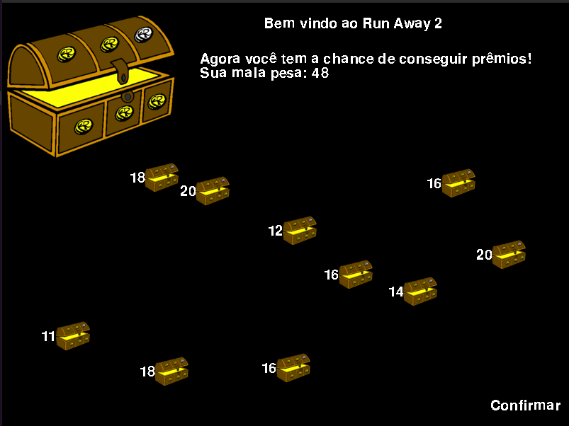
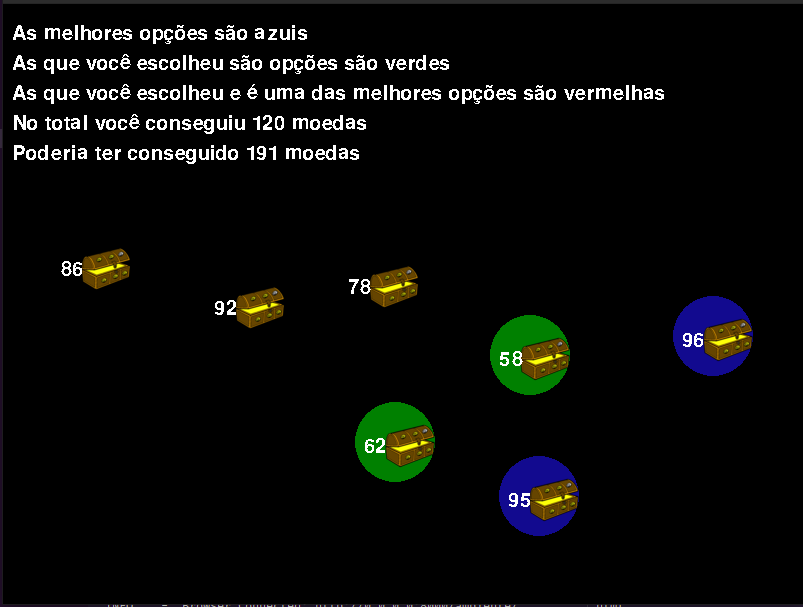
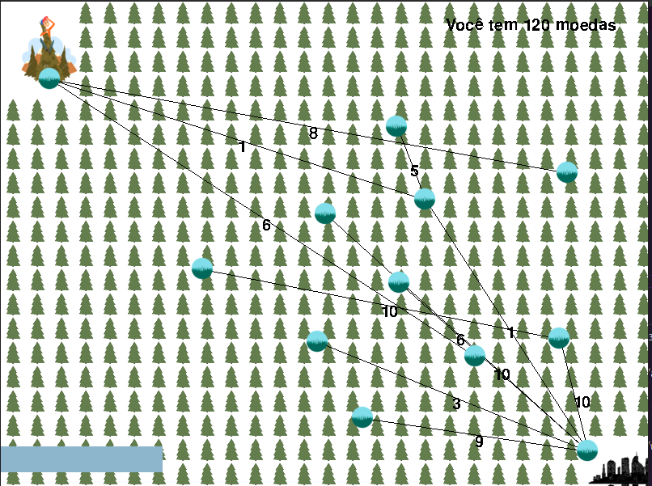

# Run away

## O que é o nosso projeto?
  É um jogo, onde jogador deve escolher os melhores tesouros para obter a maior quantidade de moedas, então ele deve adivinhar o caminho mais curto para fora da floresta para não perder as moedas.

## Membros:

| Nome | Github | Matrícula |
|---|---|---|
| Kathlyn Lara Murussi | @klmurussi | 18/0042378 |
| Júlio César Schneider Martins | @jschneiderm98 | 16/0032903 |

## Screenshots:

### Seleção de báus

### Báus selecionados

### Imagem do Run Away

## Vídeo da dupla

